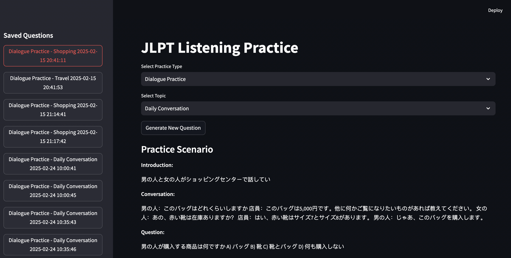

## How to run frontend

```sh
streamlit run frontend/main.py
```

## How to run backend

```sh
cd backend
pip install -r requirements.txt
cd ..
python backend/main.py
```


## Technical Uncertainty

Q: Why is the webapp not running when forked from the repo?

A: On running the app for the first time, got an error showing missing specified AWS region when trying to create a client for the Polly service on the boto3 client.
When debugging, line 12 in `audio_generator.py` boto3.client polly was missing the region.
On adding a region was able to fix this error.


### Images

