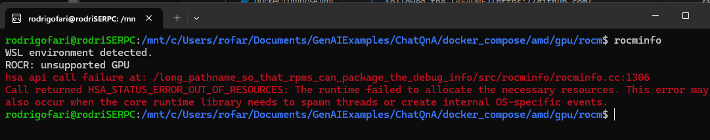

## OPEA progress
Attempt at running ChatQnA from OPEA GenAIExamples locally on a M3 Pro Apple Chip.

## Technical Uncertainty

### Will ChatQnA work on a M3 Apple Silicon chip?
OPEA currently doesnt support Apple silicon, as per trying to pull the images on `docker compose up -d` there was no matching manifest in the manifest list entries. Therefore I tried building the Docker images.

### Able to build docker images on M3 chip?
On trying to build Retrieve Image from the `GenAIComps` repo, failed. When doing some research found an [issue](https://github.com/opea-project/GenAIExamples/issues/1074) on the `GenAIExamples` saying Build Docker image on Mac is not supported yet. So instead i tried to run `ChatQnA` on a different machine.

### Running `ChatQnA` on WSL Windows 11 machine

Machine Specs
CPU: AMD Ryzen 5 5560U with Radeon Graphics
RAM: 40GB
GPU: AMD Radeon Graphics
OS: Windows 11

as per my machine specs running a AMD CPU, followed the [README](https://github.com/opea-project/GenAIExamples/blob/main/ChatQnA/docker_compose/amd/gpu/rocm/README.md) to build MegaService of ChatQnA. On `docker compose up -d` encounter another error `Issue with running your Docker image for pytorch. Missing /dev/kfd`, on doing some reseach I thought it might been related to using WSL so found some documentation on how
1. [Install Radeon software for WSL with ROCm](https://rocm.docs.amd.com/projects/radeon/en/latest/docs/install/wsl/install-radeon.html)
2. [Install PyTorch for Radeon GPUs on WSL](https://rocm.docs.amd.com/projects/radeon/en/latest/docs/install/wsl/install-pytorch.html)

After following the docs on checking if the GPU was listed as an agent (`rocminfo`)

Got the following error:

After reading the prerequisits carefully WSL requires installation of compatible driver: [AMD Software: Adrenalin Edition 24.12.1 for WSL](https://www.amd.com/en/resources/support-articles/release-notes/RN-RAD-WIN-24-12-1.html)
And I currently have [AMD Software: Adrenalin Edition 24.9.1](https://www.amd.com/en/resources/support-articles/release-notes/RN-RAD-WIN-24-9-1.html) which doesn't support WSL and 24.12.1 doesn't support my current CPU so I couldn't update the driver for WSL.
There unssucesfull to Run docker compose, docker pull the images from opea successfully but cant start the containers throwing the `Issue with running your Docker image for pytorch. Missing /dev/kfd` error.