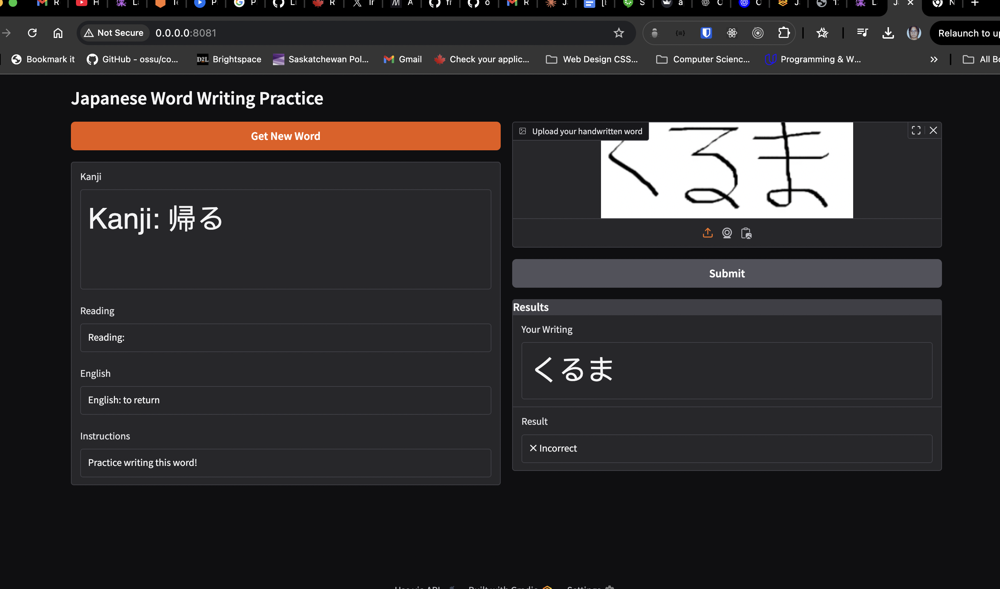

### Technical Uncertainty
Q: Will the webapp forked from the repo work when local running?
A: Had cors issues when running the frontend, and the writing gradio_word.py app wasn't working because it didn't load the vobaculary.
On debugging, the app wasn't reaching the correct endpoint, fix it by using 127.0.0.1 instead of localhost.
Tried the cursor composer recommendation to fix the CORS issues but wans't succesfull so at this moment the study activities page is showing a failed to fetch error.

### Images

